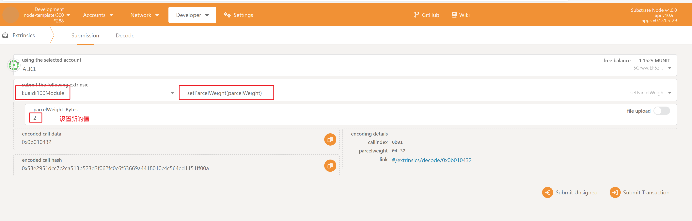
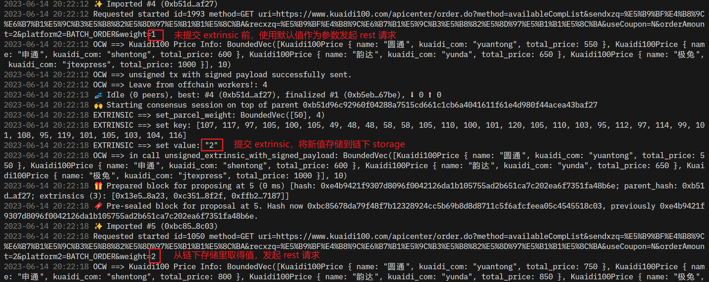
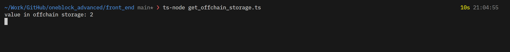

# 第四节课作业

### 作业

* 在Offchain Worker中，使用Offchain Indexing特性实现从链上向Offchain Storage中写入数据
* 使用 js sdk 从浏览器frontend获取到前面写入Offchain Storage的数据
* 设计一个场景实例（比如获取一个外部的价格信息），实现从OCW中向链上发起带签名负载的不签名交易，并在Runtime中正确处理

### 答案：

后端代码 [pallets/express](./pallets/kuaidi100)

前端代码 [front_end](./front_end)
### 截图：

